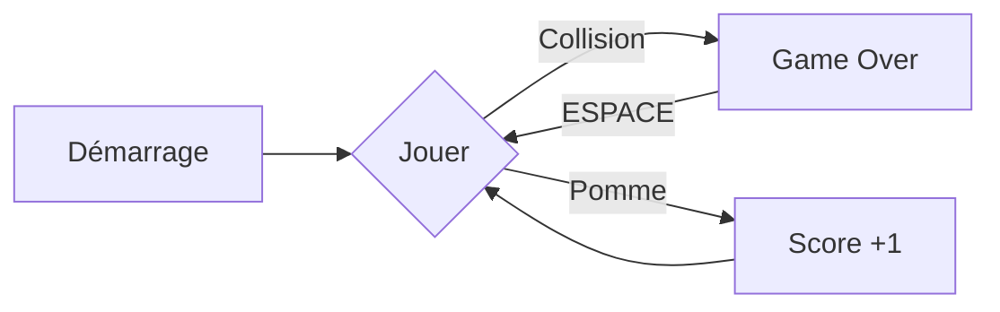

# 🎮 Snake Game

<div align="center">


*Un jeu Snake moderne et fluide développé en Java*

[](https://www.java.com/)
[](LICENSE)

</div>

---

## 🌟 Caractéristiques

<div align="center">

| 🎯 Gameplay | 🛠️ Technique | 🎨 Design |
|------------|--------------|-----------|
| Contrôles fluides | Java Swing | Interface minimaliste |
| Score progressif | Mouvements interpolés | Graphismes antialiasés |
| High score sauvegardé | Collisions précises | Design épuré |

</div>

---

## 🕹️ Comment Jouer

<div align="center">

### Contrôles

| Touche | Action |
|--------|--------|
| ↑ | Déplacer vers le haut |
| ↓ | Déplacer vers le bas |
| ← | Déplacer vers la gauche |
| → | Déplacer vers la droite |
| ESPACE | Redémarrer le jeu |

</div>

### Objectifs

- 🍎 Mangez les pommes pour grandir
- 📈 Chaque pomme = 1 point
- ⚠️ Évitez les murs et votre corps
- 🏆 Battez votre meilleur score

---

## ⚙️ Installation

```bash
# 1. Clonez le répertoire
git clone https://github.com/votre-username/snake-game.git

# 2. Accédez au dossier
cd snake-game

# 3. Compilez le jeu
javac SnakeGame.java

# 4. Lancez le jeu
java SnakeGame
```

---

## 🎯 Gameplay

<div align="center">

### Mode de Jeu



</div>

### Progression

- 🟢 Démarrage avec 3 segments
- 🔴 Chaque pomme augmente la taille
- 📊 Score sauvegardé automatiquement
- 🔄 Possibilité de rejouer instantanément

---

## 🛠️ Personnalisation

```java
// Configurez le jeu selon vos préférences
private final int WIDTH = 300;         // Largeur de la fenêtre
private final int HEIGHT = 300;        // Hauteur de la fenêtre
private final int DOT_SIZE = 10;       // Taille des segments
private final double MOVE_SPEED = 3.0; // Vitesse du serpent
```

---

## 🎨 Interface

<div align="center">

### Éléments du Jeu

| Élément | Couleur | Description |
|---------|---------|-------------|
| 🟢 Tête | Vert | Guide le serpent |
| 🟡 Corps | Jaune | Suit la tête |
| 🔴 Pomme | Rouge | Objectif à collecter |
| ⚪ Score | Blanc | Affichage en haut |

</div>

---

## 🚀 Fonctionnalités Avancées

### Système de Mouvement
- Interpolation des positions
- File d'attente des directions
- Collisions précises

### Sauvegarde
- Meilleur score persistant
- Fichier de sauvegarde automatique
- Format texte simple

---

## 💡 Astuces

<div align="center">

| 🎮 Pour Bien Jouer | ⚡ Pour la Performance |
|-------------------|----------------------|
| Anticipez vos mouvements | Fermez les applications inutiles |
| Évitez les virages serrés | Utilisez Java 8 ou supérieur |
| Planifiez votre trajectoire | Vérifiez les droits d'écriture |

</div>

---

## 🔜 Futures Améliorations

- [ ] Mode multijoueur
- [ ] Effets sonores
- [ ] Différents types de pommes
- [ ] Niveaux de difficulté
- [ ] Menu principal
- [ ] Système de pause

---

<div align="center">

## 📝 Licence

MIT © [Votre Nom]

*Fait avec ❤️ et ☕*

</div>
