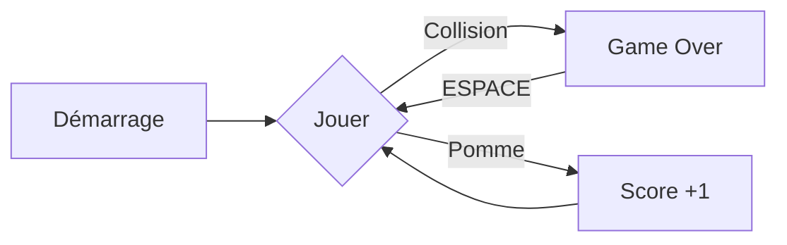

# 🎮 Snake Game

<div align="center">


*Un jeu Snake moderne et fluide développé en Java*

[](https://www.java.com/)
[](LICENSE)

</div>

---

## 🌟 Caractéristiques

<div align="center">

| 🎯 Gameplay | 🛠️ Technique | 🎨 Design |
|------------|--------------|-----------|
| Contrôles fluides | Java Swing | Interface minimaliste |
| Score progressif | Mouvements interpolés | Graphismes antialiasés |
| High score sauvegardé | Collisions précises | Design épuré |

</div>

---

## 🕹️ Comment Jouer

<div align="center">

### Menu Principal
| Touche | Action |
|--------|--------|
| ↑ | Option précédente |
| ↓ | Option suivante |
| ENTRÉE | Sélectionner option |
| ÉCHAP | Retour au menu |

### Menu Difficulté
| Touche | Action |
|--------|--------|
| ↑ | Difficulté précédente |
| ↓ | Difficulté suivante |
| ENTRÉE | Valider difficulté |
| ÉCHAP | Retour au menu |

### En Jeu
| Touche | Action |
|--------|--------|
| ↑ | Déplacer vers le haut |
| ↓ | Déplacer vers le bas |
| ← | Déplacer vers la gauche |
| → | Déplacer vers la droite |
| P ou ÉCHAP | Pause |
| ESPACE | Reprendre |
| M | Son On/Off |
| +/- | Volume |

</div>

### Objectifs

- 🍎 Mangez les pommes pour grandir
- 📈 Différents types de pommes = différents points
- ⚠️ Évitez les murs et votre corps
- 🏆 Battez votre meilleur score

---

## ⚙️ Installation

```bash
# 1. Clonez le répertoire
git clone https://github.com/votre-username/snake-game.git

# 2. Accédez au dossier
cd snake-game

# 3. Compilez le jeu
javac SnakeGame.java

# 4. Lancez le jeu
java SnakeGame
```

---

## 🎯 Gameplay

<div align="center">

### Mode de Jeu



</div>

### Types de Pommes
| Type | Couleur | Points | Effet |
|------|---------|---------|-------|
| Normale | Rouge | 1 | - |
| Dorée | Jaune | 3 | - |
| Vitesse | Verte | 1 | Vitesse x2 (5s) |
| Lente | Bleue | 1 | Vitesse /2 (3s) |
| Arc-en-ciel | Magenta | 2 | Score x2 (10s) |

### Niveaux de Difficulté
| Niveau | Vitesse | Multiplicateur |
|--------|---------|----------------|
| Facile | x1.0 | x1.0 |
| Normal | x1.5 | x1.2 |
| Difficile | x2.0 | x1.5 |
| Expert | x2.5 | x2.0 |

---

## 🛠️ Personnalisation

```java
// Configurez le jeu selon vos préférences
private final int WIDTH = 300;         // Largeur de la fenêtre
private final int HEIGHT = 300;        // Hauteur de la fenêtre
private final int DOT_SIZE = 10;       // Taille des segments
private final double MOVE_SPEED = 3.0; // Vitesse du serpent
```

---

## 🎨 Interface

<div align="center">

### Éléments du Jeu

| Élément | Couleur | Description |
|---------|---------|-------------|
| 🟢 Tête | Vert | Guide le serpent |
| 🟡 Corps | Jaune | Suit la tête |
| 🔴 Pomme | Variable | Objectif à collecter |
| ⚪ Score | Blanc | Affichage en haut |

</div>

---

## 🚀 Fonctionnalités Avancées

### Système de Mouvement
- Interpolation des positions
- File d'attente des directions
- Collisions précises

### Sauvegarde
- Meilleur score persistant
- Fichier de sauvegarde automatique
- Format texte simple

### Sons
- Fichiers nécessaires :
  ```
  /src/sounds/
  ├── move.wav   (75ms)
  ├── eat.wav    (250ms)
  ├── crash.wav  (600ms)
  └── start.wav  (1.2s)
  ```

---

## 💡 Astuces

<div align="center">

| 🎮 Pour Bien Jouer | ⚡ Pour la Performance |
|-------------------|----------------------|
| Anticipez vos mouvements | Fermez les applications inutiles |
| Planifiez votre trajectoire | Vérifiez les droits d'écriture |
| Utilisez les pommes spéciales | Utilisez Java 8 ou supérieur |

</div>

---

## 🔜 Futures Améliorations

- [x] Menu principal
- [x] Système de pause
- [x] Effets sonores
- [x] Différents types de pommes
- [x] Niveaux de difficulté
- [x] Sauvegarde des scores
- [ ] Obstacles
- [ ] Thèmes visuels
- [ ] Classement en ligne
- [ ] Mode survie
- [ ] Power-ups supplémentaires
- [ ] Mode défi
- [ ] Tutoriel interactif
- [ ] Achievements
- [ ] Options de personnalisation

---

<div align="center">

## 📝 Licence

MIT © Filox

*Fait avec ❤️ et ☕*

</div>
